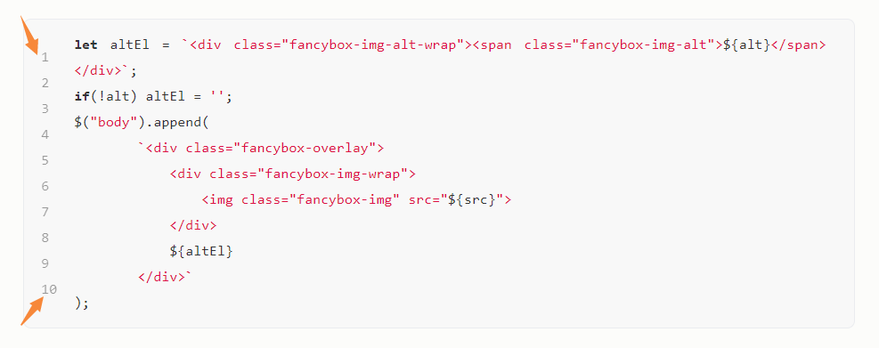
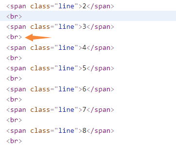
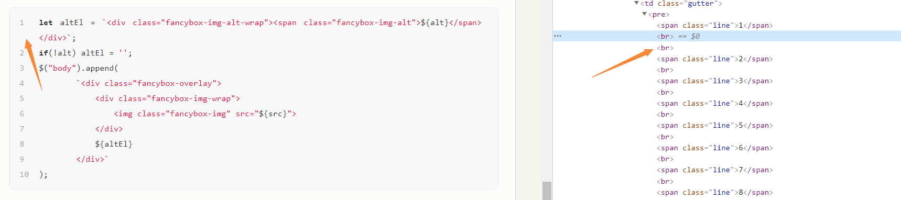
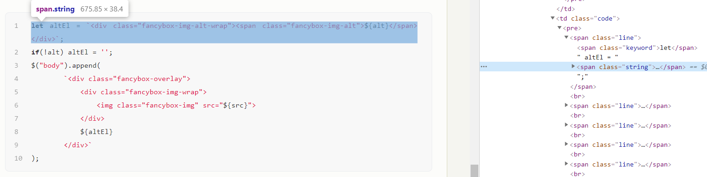
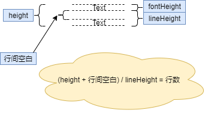
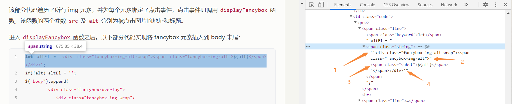
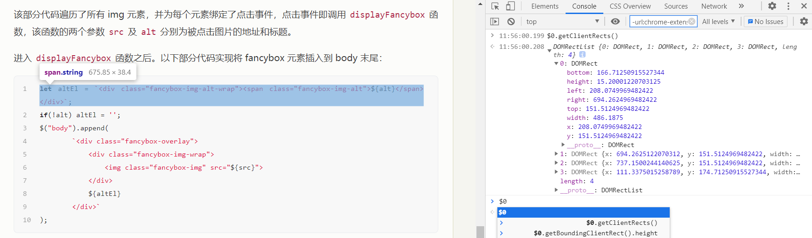
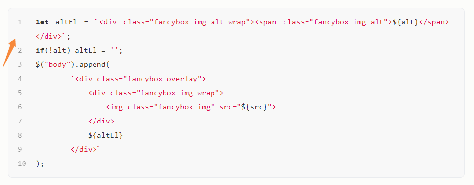

要使 Hexo 代码块自动换行，一要使用 CSS 声明文本自动换行，二要用 JavaScript/jQuery 实现偏移代码块行数。

<!-- more -->

### CSS

要使代码块（pre 元素）自动换行，只需要为其添加如下属性：

```CSS
pre {
    white-space: pre-wrap;
    word-break: break-word;
}
```

下面是这两个属性生效后的效果，代码块的确自动换行了，但同时出现了行号不再与相应行对齐的问题：



这时候需要用 JS/jQuery 代码来解决。

### JavaScript 求行数

查看 HTML 可以发现 Hexo 行号使用 `<br>` 来换行：



所以我们可通过在相应位置插入 br 标签的方式来保证对齐。显然应该插入多少个 br 标签应该由一行代码自动换了多少行决定，`br 标签的插入数 = 实际显示行数 - 1`，比如在上面的演示中，有一行代码自动换成了两行，所以我们应该在该行对应的行号下方插入一个 br 标签：



所以现在的关键在于计算 HTML 元素中的文本行行数：



计算行数可使用如下函数：

```JavaScript
function countLines(el) {
    // 获取元素总高度
    let height = el.getBoundingClientRect().height;
    // 获取元素行高
    let lineHeight = parseFloat(window.getComputedStyle(el).lineHeight.replace('px',''));
    // 获取元素字体高
    let fontHeight = el.getClientRects()[0].height;
    // 计算行数
    let lineCount = Math.round((height-fontHeight+lineHeight) / lineHeight);
    return lineCount;
}
```

其中`el.getBoundingClientRect().height`获取到的是元素的像素高度：

接着，使用`parseFloat(window.getComputedStyle(el).lineHeight.replace('px',''))`来获取行高，注意对于其他网站，这种方法不一定能够正确获取到行高，因为`window.getComputedStyle(el).lineHeight`也可能是`normal`等其他值，所以如果你希望能够在自己的网站上使用这种求法，必须避免使用 normal 之类的值来设置行高。

然后可以看到，后面先是求了一个`fontHeight`值，然后才使用`Math.round((height-fontHeight+lineHeight) / lineHeight)`来求行数，这里之所以不直接使用`元素总高度/行高`来计算行数，是因为行高是指行基线之间的距离（与两底线距离相同，见下图 lineHeight），而元素总高（下图 height）还需要加一个行高中的空白高度（下图“行间空白”）才是行高的整数倍：



由图可见`行间空白 = lineHeight - 单行文字的高度`，所以我们还需要计算出单行文字的高度，也就是 fontHeight。这里使用`el.getClientRects()[0].height`来求，其中的 getClientRects 函数能够获得元素的所有子内容的位置数据：





这个值不能够用`font-size`来求，因为与 line-height 一样 font-size 不一定以像素为单位，更重要的是，font-size 并不等于元素高度（至少我遇到了这个问题）。

所以，由`(height + 行间空白) / lineHeight = 行数`，即有`lineCount = Math.round((height-fontHeight+lineHeight) / lineHeight)`。

除了没考虑可能的 margin、padding 属性的影响外，上述函数的求法的确算是比较详细的了，然而，既然用上了 getClientRects 函数，那么事实上我们还有更简洁的求行数方法：

```JavaScript
function countLines2(el) {
    const rects = el.getClientRects();
    let lineCount = 1;
    for(let i=1; i<rects.length; i++){
        if(Math.abs(rects[i].top-rects[i-1].top)>1){
            lineCount++;
        }
    }
    return lineCount;
}
```

这个函数的原理是对于一行代码的每一个 clientRect，如果它们在同一行，那么每个 clientRect 的 top 值都应该相同，而如果 top 值不相同，则说明存在换行，所以，可使用`if(Math.abs(rects[i].top-rects[i-1].top)>1)`来判别是否换行，如果换行，则 lineCount 加一，遍历完所有子内容之后即可得到总行数。

### 最终代码

在得到代码行数之后，即可根据需要插入 br 标签，最终代码为：

```JavaScript
(function(){
    function countLines2(el) {
        const rects = el.getClientRects();
        let lineCount = 1;
        for(let i=1; i<rects.length; i++){
            if(Math.abs(rects[i].top-rects[i-1].top)>1){
                lineCount++;
            }
        }
        return lineCount;
    }
    // 选择代码行
    let codeLines = $('td.code>pre>.line');
    // 选择代码行行数
    let nums = $('td.gutter>pre>.line');
    nums.each(function (index) {
        let lineCount = countLines2(codeLines[index]);
        if(lineCount > 1){
            // 插入指定个数的<br>
            let space = Array(lineCount).join("<br>");
            $(this).after(space);
        }
    });
})();
```

将该部分代码注入 Hexo 页面即可实现对齐行号：



不过，说实话，最好的让代码块不产生滚动条的方式其实是自己给 Markdown 代码换行，正如我们写代码的时候最好不要让代码超过屏幕。