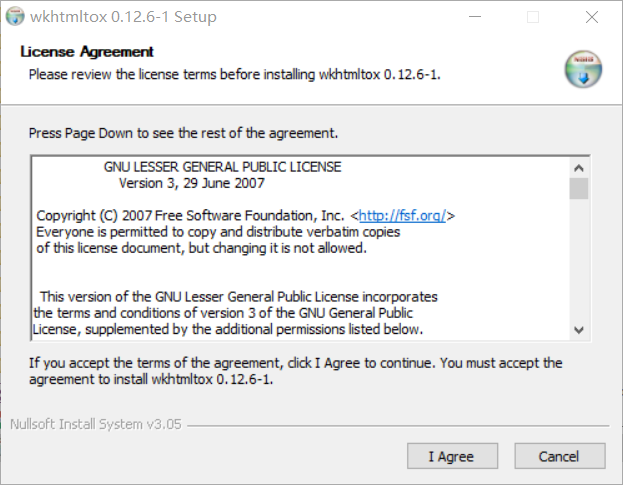

最近尝试用 pdfkit 来将 HTML 转换成 PDF，用过的都知道，除了需要安装 pdfkit 模块以外，还要在 [wkhtmltopdf](https://wkhtmltopdf.org/downloads.html) 下载一个安装包。

我先是将安装包（wkhtmltox.exe）放在了`C:\Users\liuhao\Desktop\program\`下，然后尝试执行下面的代码：

```python
import pdfkit
path_wkthmltopdf = r"C:\Users\liuhao\Desktop\program\wkhtmltox.exe"
config = pdfkit.configuration(wkhtmltopdf = path_wkthmltopdf )
pdfkit.from_url(
    "https://www.baidu.com/", r"C:\Users\liuhao\Desktop\program\out.pdf", configuration=config)
```

结果报错。

发现问题是，必须先安装 exe 程序：



然后在`C:\Program Files\wkhtmltopdf\bin`目录下找到`wkhtmltopdf.exe`，使用它的路径来赋值给`path_wkthmltopdf`变量，此时程序才可正常运行。

参考：[python 3.x - pdfkit [WinError 740] The requested operation requires elevation python3 - Stack Overflow](https://stackoverflow.com/questions/59641793/pdfkit-winerror-740-the-requested-operation-requires-elevation-python3)
