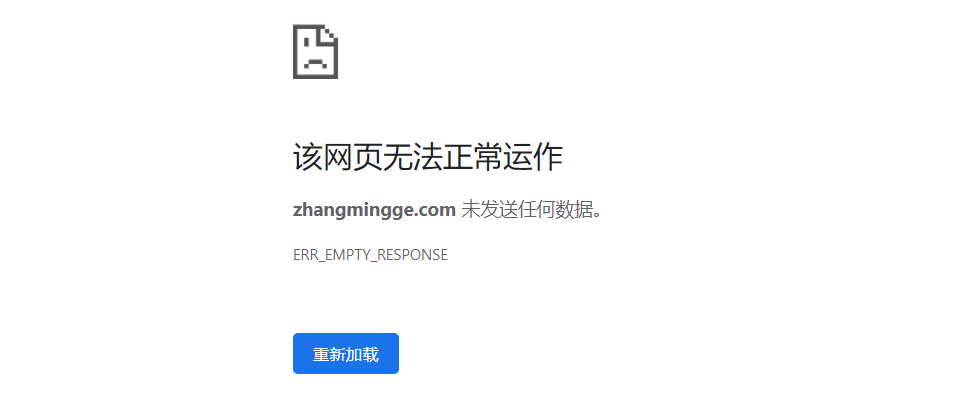

之前在博客园发过几篇博客，总觉得不太好，还是希望能够有自己搭建的博客，所以就有了以下的一些尝试。

<!-- more -->

### 尝试搭建动态博客

因为希望有足够大的自定义空间，所以最初是准备搭建动态博客。

首先看了[ WordPress 新手教程：20 分钟从零开始教你搭建个人网站](https://www.bilibili.com/video/av44358700?p=1&t=373)，大概有了点思路。

从视频了解到搭建动态博客需要注册域名并购买主机，于是开始购买域名和主机。因为希望博客能够尽可能稳定地运行，所以没有按照视频中建议的方式购买，而是决定选择比较常见的服务提供商。我选择的是华为云。

进入[域名购买](https://www.huaweicloud.com/product/domain.html?ticket=ST-578293-aXBJ5CT7Wd2VasQ1LZbc4Chk-sso&locale=zh-cn)可购买域名。第一个问题是我的名字所对应的以 com 为后缀的域名已经被注册了，而同时我又实在不想使用后缀名不常见的域名，所以最终决定不再使用自己的名字，转而使用 zhangmingge。

同样，进入[弹性云服务器](https://console.huaweicloud.com/ecm/?agencyId=0952309086800fca1fa9c01871c73f76&region=cn-north-4&locale=zh-cn#/ecs/manager/vmList)后点击“购买弹性云服务器”可购买主机。购买过程中遇到了不少陌生的名词，不过借助于官网提示及搜索引擎最终购买成功。

从较为常见的域名供应商购买域名和服务器之后需要做域名备案。备案按照官网上的指示来就可以了，需要等待一段时间。

备案完成后将域名解析至买到的服务器，接着就可以搭建博客了。因为我购买的是操作系统为 CentOS8（Linux 发行版之一）的服务器，所以首先在华为云官网上找了这样一篇教程：[手工部署 WordPress（Linux）](https://support.huaweicloud.com/bestpractice-ecs/zh-cn_topic_0135015337.html)，并参照这个教程开始实践了，前面的命令没什么问题，但中间有一个地方出错了，并且我没能找到合适的解决方案。有那么点小失望...

睡一觉之后，发现华为云官网上还有个[安装宝塔面板](https://support.huaweicloud.com/bestpractice-ecs/zh-cn_topic_0178996061.html?utm_source=ecs_Growth_map&utm_medium=display&utm_campaign=help_center&utm_content=Growth_map)的教程，宝塔面板能提供类似于 Windows 的用户界面，对新手友好，而且上面那个视频博主搭建博客时使用的就是宝塔面板，所以，我决定先安装面板，然后再参考上面的视频搭建博客。

华为云官网的文档是在 CentOS7.x 上做安装演示，而我购买的服务器的系统是 CentOS8，所以自己另外找了一篇教程—— [CentOS8 安装宝塔](https://blog.csdn.net/lxw983520/article/details/102964959)，参考该教程，我成功安装好了宝塔面板。

接着我参考上面的视频安装好了 WordPress，但最终网页上不显示博客而总是显示为“welcome to nginx”。从 [Nginx 发布网页后，页面一直是默认页面 welcome to nginx](https://blog.csdn.net/qq_23027341/article/details/104570487) 了解到这是因为 Nginx 配置出错，于是尝试修改配置，修改配置需要先找到本机的配置文件，于是参考 [Nginx 快速查看配置文件的方法](https://blog.csdn.net/fdipzone/article/details/77199042)找到了配置文件，并尝试使用 vim 对其进行修改，期间遇到了使用 vim 打开 nginx.conf 文件时命令行提示“Swap file ".nginx.conf.swp" already exists!”的情况，最终参考[打开 Nginx 中的 nginx.conf 文件出现“Swap file ".nginx.conf.swp" already exists!”的解决方法](https://blog.csdn.net/qq_42449963/article/details/102916995)解决了这个问题。

修改完后按理来说已经可以正常访问博客了，但结果博客仍然显示“welcome to nginx”，后来了解到这可能是因为安装了多个版本的 Nginx（我在参考华为云官网文档时安装了一次，后来又使用宝塔面板安装了一次），于是，我参考[彻底删除 CentOS 上的 Nginx](https://blog.csdn.net/xinyflove/article/details/83108379) 将 Nginx 删除，并在宝塔面板中重新安装 Nginx 并改好了配置。

这时网站就能够正常访问了。

然后是选择博客主题。最开始是直接在 WordPress 面板上找，发现下载主题时常常会出现“更新失败”的情况，了解到这是因为 WordPress 没有写入权限，需要更改主题文件夹的权限使得文件夹能够被写入。可以使用命令行更改权限，因为我对命令行不熟悉，所以在宝塔面板中做的更该（可参考 [CentOS 修改文件夹权限](https://blog.csdn.net/u013939884/article/details/56171741)），在更改完权限并成功下载到想要的主题后，我将主题文件夹设置回了原来的权限状态。

虽然 WordPress 上的主题不少，但我没有找到自己真正喜欢的类型，于是我开始在 GitHub 上寻找开源主题，最终选择了 [Sakura](https://github.com/mashirozx/Sakura)，甜的和简洁的主题我都喜欢，而 Sakura 属于甜的类型（当然也不失简洁）。

安装好后，我发现博客的访问速度很慢，查看宝塔面板发现显示运行阻塞：


同时常常出现博客无法正常访问的现象：



本来以为是 WordPress 的问题，后来发现原来是因为这个主题对于我的服务器来说太大了。所以最终我换回了较轻的主题。

接着我尝试安装一些优化 WordPress 的插件，发现在安装插件的过程中也会出现安装失败的情况。一个临时的解决方案是的从[官网](https://wordpress.org/plugins/)下载插件，然后通过宝塔面板将插件上传到服务器指定目录，但更好的方式或许是像解决主题更新失败那样更改文件夹权限。

另外，在配置 Wordfence 插件的过程中，有一个修改 .user.ini 文件的步骤，这时也会出现修改失败的情况，我起初以为也能够通过更改权限来解决，结果发现这个文件的权限根本无法通过之前所使用的方式来更改（无论是从宝塔面板还是从命令行）。这时，需要先参考 [Wordfence 无权限操作 .user.ini 文件](https://xulingjun.com/wordfence-%E6%97%A0%E6%9D%83%E9%99%90%E6%93%8D%E4%BD%9C-user-ini%E6%96%87%E4%BB%B6/)执行 `chattr -i /完整目录/.user.ini` 命令后，再更改权限。

经过前面的尝试，我意识到对现在的我来说，要搭建一个动态博客一方面不那么简单，另一方面，成本也比较大。我不想再购买更好的服务器了，所以最终决定搭建静态博客，值得高兴的是，在我进一步了解过静态博客之后，发现它完全能够满足我的需求，而且静态博客往往偏向于简洁，这也是我很喜欢的一点。

于是，我开始了静态博客的搭建之路。

### 尝试搭建静态博客

我没有再使用自己购买的服务器，而是决定借助 GitHub pages 来搭建，搭建过程很顺利，参考[手把手教你从 0 开始搭建自己的个人博客](https://www.bilibili.com/video/av44544186?p=1&t=630)很快就搭建好了博客。

搭建好后，综合考虑美观度、可自定义程度等方面决定以 [Icarus](https://github.com/ppoffice/hexo-theme-icarus) 作为博客主题，按照官方文档操作也比较方便地安装好了。

安装完成后，发现主页的文章不会显示“阅读更多”或“Readmore”，参考 [Hexo 自动给博文添加 ReadMore](https://blog.zthxxx.me/post/hexo-automatic-add-readmore/)得知这是因为需要显式地在 Markdown 文件中添加`<!-- more -->`，该注释将会被处理为首页文章收缩的界限，界限以下的内容将不会在首页显示。

然后发现进入文章后，侧边栏不显示目录，参考 [Icarus 改造：默认开启目录（toc）功能](https://newbie8.com/posts/d61f8acb/)得知可以通过在 Markdown [Front-matter](https://hexojs.github.io/zh-cn/docs/front-matter.html) 中显式地指明 toc 为 true 来使侧边栏显示目录，后来又了解到，其实可以通过在博客配置文件 _config.yml 中增加 toc: true 来将侧边栏显示目录设置为默认。

接下来又在配置文件中设置好了 RSS，主题 RSS 的 atom.xml 文件可由 Hexo 插件 hexo-generator-feed 自动生成，位于博客主目录的 public 文件夹下，要显示 RSS，只需如下设置主题配置文件：

```yaml
head:
    ...
    rss: /atom.xml
...
RSS:
    icon: fas fa-rss 
    url: /atom.xml

```

之后开始配置评论系统，发现官网所介绍的评论系统都不是很好，在一番寻找之后决定使用 [Twikoo](https://github.com/imaegoo/twikoo)，配置过程官网有介绍，这里就不总结了。

然后，因为我买了域名，所以参考 [Github pages 绑定个人域名](https://segmentfault.com/a/1190000011203711)将域名绑定到了 GitHub pages，需要注意的是，绑定好后再使用 Hexo 部署到 GitHub 会出现绑定解除的现象，参考 [Hexo 发布之后 GitHub pages 自定义域名失效](https://blog.csdn.net/xs20691718/article/details/81873921)可解决该问题。

后来又发现网站访问比较慢并且字体加载正常，这是因为主题默认的 CDN 服务提供商配置为：

```yaml
providers:
    cdn: jsdelivr
    fontcdn: google
    iconcdn: fontawesome
```

其中 google 和 fontawesome 访问受限，所以博客加载慢，将 fontcdn 及 iconcdn 修改为 loli 即可：

```yaml
providers:
    cdn: jsdelivr
    fontcdn: loli
    iconcdn: loli
```

更多信息可参考 [Icarus 用户指南 - CDN 提供商](https://blog.zhangruipeng.me/hexo-theme-icarus/Configuration/icarus%E7%94%A8%E6%88%B7%E6%8C%87%E5%8D%97-cdn%E6%8F%90%E4%BE%9B%E5%95%86/)。

接着发现每次部署到 GitHub 后总是会收到 GitHub 发送的内容为 `The page build completed successfully, but returned the following warning...` 的邮件，最终参考 [GitHub pages 外部域名](https://segmentfault.com/q/1010000011240038)将问题解决。

Icarus 支持在写文章时使用 Bulma。在 Markdown 中使用 Bulma 虽能够快速创建丰富多彩的元素，但同时也降低了 Markdown 的可移植性（在不支持 Bulma 的主题中 Bulma 元素将不起作用），综合考虑其他原因之后，我决定换一个主题，最终选择了 [cactus](https://github.com/probberechts/hexo-theme-cactus)，同时，评论功能也暂时舍弃。

在使用过一段时间的 cactus 之后，最终还是觉得写一个自己主题要更好，所以，尝试制作属于自己的主题，然而，因为太难看，最终还是决定先用别人的主题（[Anatole](https://github.com/Ben02/hexo-theme-Anatole)），等到自己的主题已经过得去之后再换回来。

然而使用了不久之后，发现 Hexo generate 命令总是报错，换成其他主题也没有用，在网上也没有找到答案，所以，我最终又回到了博客园。果然是技术还不过关啊，还是先在博客园待一段时间吧，而且说到底开头所提到的“不太好”，其实根本上是因为我压根就没有认真发表过几篇用心的博文，所以关键不在于平台，而在于内容。

以上就是我博客搭建的大致过程。